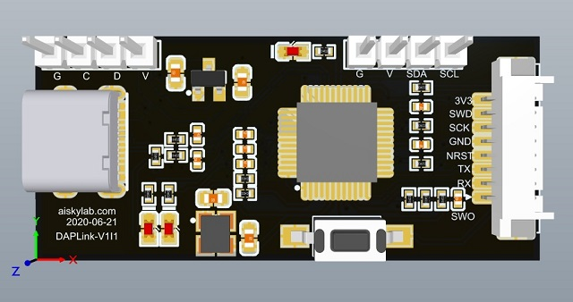
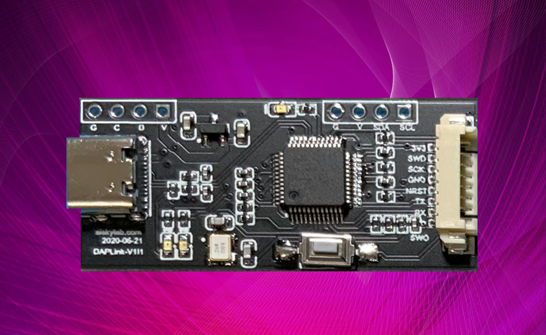

# AISkyLab-DAPLink-STM32F103CBT6调试器

[中文文档](index.md) 

## 简介

AISkyLab-DAPLink-STM32F103CBT6 基于开源硬件项目： [ARMmbed - mbed-HDK](https://github.com/ARMmbed/mbed-HDK) 和 [ArmMbed - DAPLink](https://github.com/ARMmbed/DAPLink)项目。其中的原理图按照官方图纸设计STDAP_V_1_0_0-SCH进行设计，其中做出了部分改进：

1. USB连接器改为16Pin type-c接口
2. 下载接口使用gh1.25-8Pin。

其主要功能有：

- MSC -拖拽下载功能
- CDC - 可用来打印，跟踪和仿真的虚拟串口
- HID - CMSIS-DAP 兼容调试通道
- WEBUSB HID - CMSIS-DAP 兼容调试通道

## 硬件设计

使用该项目，你可以按照下面的步骤：

1. 克隆我的项目或者**fork之后从您fork的仓库克隆（我更推荐这种方式）**。
2. 使用的Altium designer 版本： 推荐 AD 17之后的版本。

如果你不想自己做硬件，想用通过现有的硬件来学习DAP-Link的源码和设计思路，你可以购买我已经做好的电路。

---->>    [淘宝店铺DAPLink](https://item.taobao.com/item.htm?spm=a1z10.1-c-s.w137644-21459655781.38.379c570fqAXVQ9&id=622440970348)

## DAP-Link开发环境搭建

如果你想下载官方的源码，请参考这个项目：  [ArmMbed - DAPLink](https://github.com/ARMmbed/DAPLink)

开发环境的搭建过程请按这里的指导进行： [源码编译指导](https://github.com/ARMmbed/DAPLink/blob/master/docs/DEVELOPERS-GUIDE.md)

## 小结

感谢ARMmbed项目的开发者，但因为原版资料为英文资料，国内众多开发者使用不方便。且基于STM32的DAPLink固件编译需要使用python运行脚本，开发环境的搭建对于初学者有一定的难度，我还是决定将自己所做的这些工作开源出来，希望能够为开源事业做出一份贡献。

