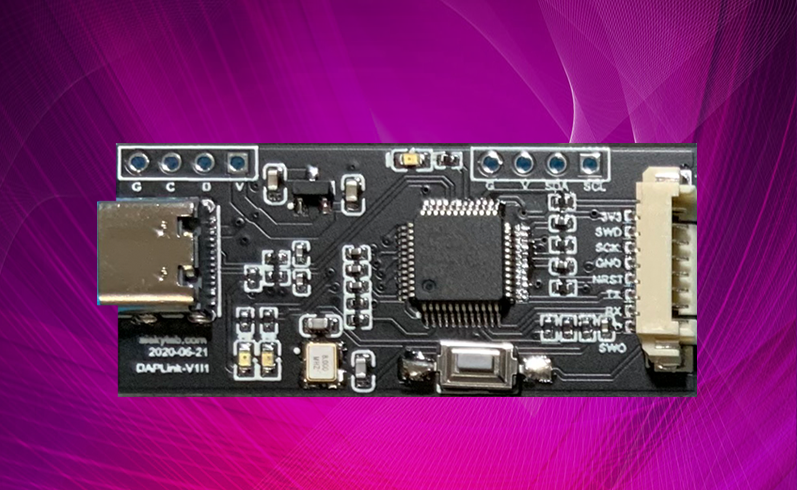

## 硬件设计

使用该项目，你可以按照下面的步骤：

1. 克隆我的项目或者**fork之后从您fork的仓库克隆（我更推荐这种方式）**。
2. 使用的Altium designer 版本： 推荐 AD 17之后的版本。

如果你不想自己做硬件，想用通过现有的硬件来学习DAP-Link的源码和设计思路，你可以购买我已经做好的电路。

---->>    [淘宝店铺DAPLink](https://item.taobao.com/item.htm?spm=a1z10.1-c-s.w137644-21459655781.38.379c570fqAXVQ9&id=622440970348)